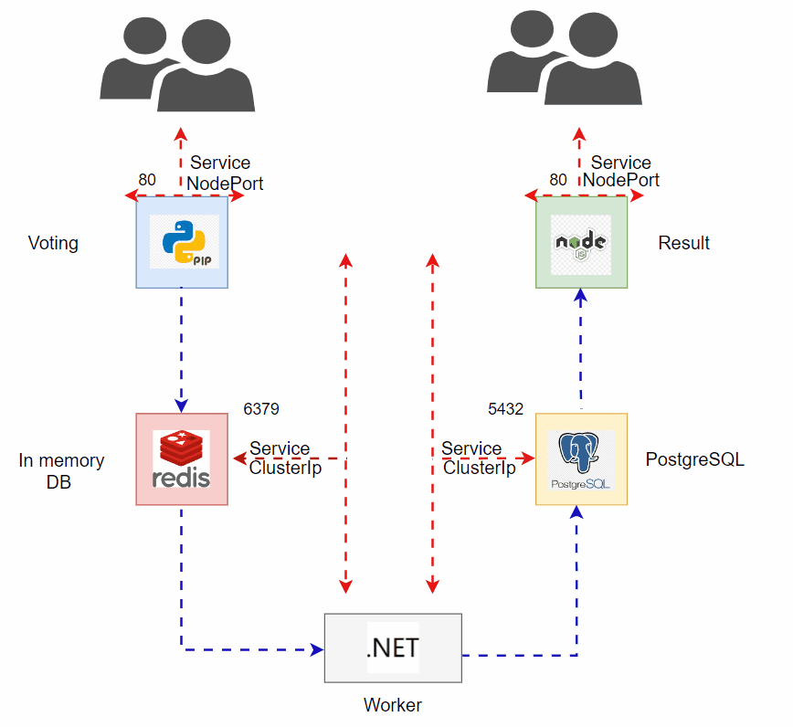
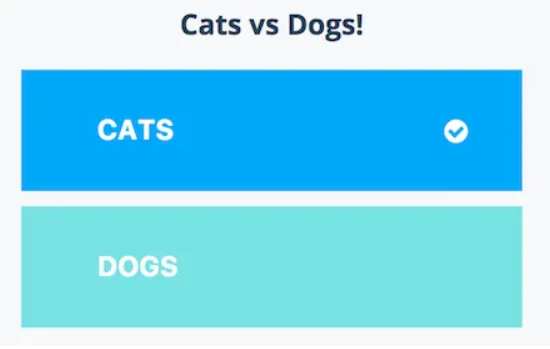
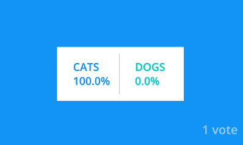

# K8s Voting App

This folder consists of a Kubernetes (k8s) voting application. The application architecture is as below:



- **Voting Interface**: Allows users to cast votes and runs on port 80 



- **Result Interface**: Allows users to see the voting results and runs on port 80 



- **Redis**: Serves as the in-memory database and runs on port 6379 
- **Worker App**: Fetches data from Redis and updates the PostgreSQL database.It is not a service 
- **PostgreSQL**: For storing result from worker app and runs on port 5432 

## Application Overview

- **Voting Application**: Exposed over a service on pod port 80.
- **Result Application**: Exposed over pod port 80.
- Both Voting and Result applications are exposed using services on node ports.
- The Voting and Result applications are created as deployments in the manifests.

## Services
- **Voting Application**: Exposed over a Nodeport service on Nodeport 30004. 
- **Result Application**: Exposed over a Nodeport serviceon Nodeport 30005. 
- **Redis**: Exposed as a ClusterIP service on port 6379.
- **PostgreSQL**: Exposed as a ClusterIP service on port 5432.

## Manifest Files

* The folder includes all the required manifest files to create and deploy the application in Kubernetes.

```
kubectl apply -f .
```